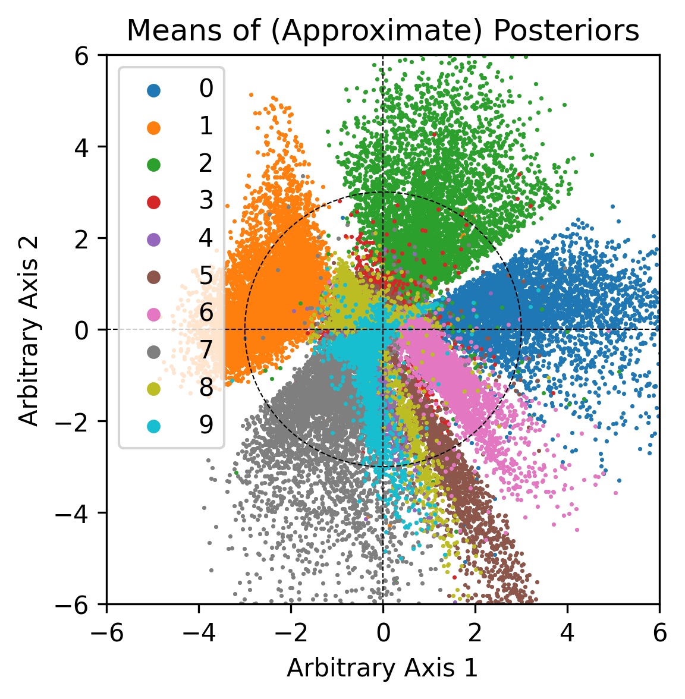

# pytorch-vae
Elegant VAE using torch.distributions, trained on MNIST.

By default, the code trains and visualizes a VAE with a latent dimension of 2.

## Visualizations

Generations | Posterior Means (Train Set)
:--------:|:------:|
 | 

## How to run

```bash
cd src
```

```bash
python train_mnist.py
```

This script above logs to tensorboard, so you can use tensorboard to visualize training stats (ELBO, KL, reconstruction).

After this script finishes, the model will get saved to `src/saved_model`. 

```bash
python plot_posterior_means.py
```

This script above saves a png to `src`.
