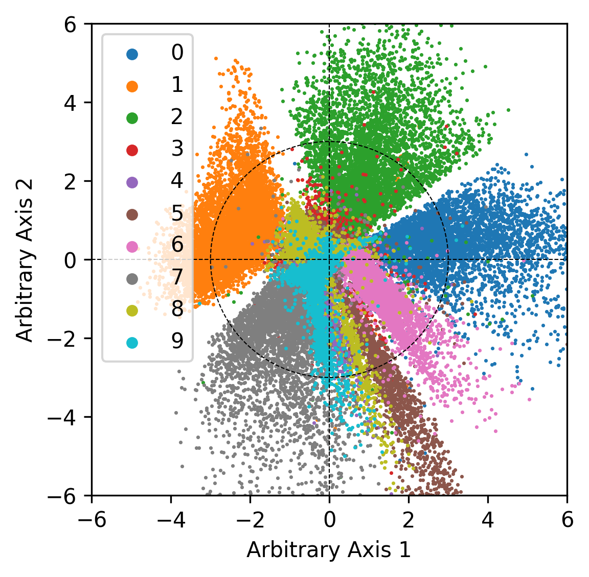

# Variational Autoencoder

Elegant VAE using torch.distributions, trained on MNIST.

When you read the code, you might have the illusion that you are reading pseudocode (since I rely heavily on `torch.distributions` and functions that are readily available in PyTorch - so things seem too simple to be true)! 

Feel free to drop a question in Issues.

## Visualizations

Generations | Posterior Means (Train Set)
:--------:|:------:|
 | 

## How to run

Change working directory:

```bash
cd src
```

Run training script:

```bash
python train_mnist.py
```

By default, the script above trains a VAE with a latent dimension of 2 for 10 epochs.

This script above logs to tensorboard (i.e., as `.local` in `src/runs`), so you can use tensorboard to visualize training stats (ELBO, KL, reconstruction) and generations on a per-epoch basis. I already have a log file in side `src/runs`, which you can visualize without training anything yourself.

Code for opening tensorboard:

```bash
tensorboard --logdir=runs
```

After training finishes, the model will get saved to `src/saved_model`. 

This script below loads from `src/saved_model` and saves a png to `src`:

```bash
python plot_posterior_means.py
```

## Dependencies

Please adapt `tensorflow-macos` to your own device.

```
pip install numpy==1.22.2 torch==1.10.2 torchvision==0.11.3 tensorflow-macos==2.8.0 keras==2.8.0 matplotlib==3.5.1
```
